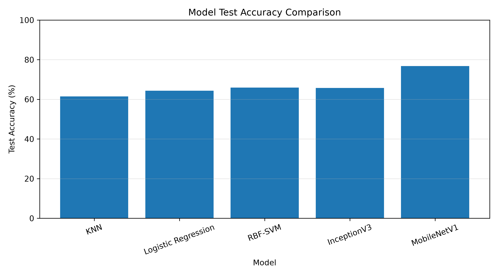
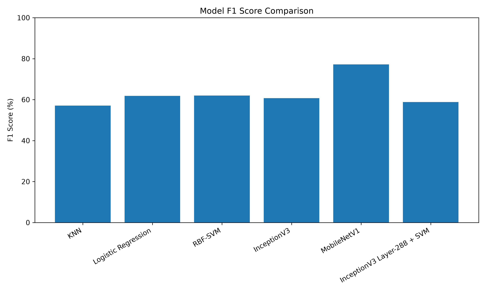

# Structural Damage Recognition

## Overview

Structural Damage Recognition is a machine learning project for binary classification of structural images into two categories:

- **Damaged**
- **Undamaged**

The project evaluates classical machine learning and deep learning approaches using a common dataset and held-out test set. The evaluated models include feature-based classical classifiers, transfer-learning CNNs, and an intermediate-feature SVM approach based on the reference study *Structural Damage Image Classification*.

Model performance is evaluated using:

- Accuracy
- Precision
- Recall
- F1-score
- Confusion matrices

The primary objective is to compare different feature representations and classification approaches and identify the most effective model for structural damage recognition.

---

## Objectives

The project aims to:

- Prepare and analyze the structural damage dataset.
- Establish a reproducible training and validation split.
- Maintain a completely separate test set for final evaluation.
- Develop a reusable data loading and preprocessing pipeline.
- Evaluate classical machine learning approaches using deep CNN features.
- Evaluate transfer-learning-based CNN classifiers.
- Reproduce the selected experiments from the reference paper.
- Compare all evaluated models using consistent evaluation metrics.
- Analyze classification errors and model behavior.
- Maintain a reproducible and well-documented implementation.

---

# Dataset

The dataset consists of RGB structural images represented as numerical arrays of size:

```text
224 × 224 × 3
```

The classification task contains two classes:

- **Damaged**
- **Undamaged**

### Dataset Size

| Dataset | Samples |
|---|---:|
| Original Training Dataset | 11,811 |
| Validation | 1,182 |
| Test | 1,460 |

The original 11,811 training samples are divided using a **stratified 90/10 train-validation split**:

- Training: **10,629**
- Validation: **1,182**

The original **1,460 test samples remain completely separate** and are used only for final evaluation.

### Class Distribution

#### Training Dataset

| Class | Samples |
|---|---:|
| Undamaged | 6,282 |
| Damaged | 5,529 |

#### Test Dataset

| Class | Samples |
|---|---:|
| Undamaged | 745 |
| Damaged | 715 |

The stratified split preserves the relative class distribution between training and validation data.

---

# Preprocessing

The dataset is provided in a preprocessed numerical representation.

Observed pixel statistics:

| Statistic | Value |
|---|---:|
| Minimum | -123.68 |
| Maximum | 151.061 |
| Mean | 14.082709 |
| Standard Deviation | 59.887745 |

The dataset is already preprocessed, therefore the image values are **not divided by 255 again**.

The labels are represented using one-hot encoding for the neural-network experiments.

For the classical machine learning experiments, extracted feature vectors are standardized using `StandardScaler` where specified.

---

# Experimental Methodology

The project evaluates two primary approaches.

## 1. Deep Feature-Based Classical Machine Learning

InceptionV3 is used as a feature extractor.

The output of the InceptionV3 Global Average Pooling layer produces a:

```text
2048-dimensional feature vector
```

These features are then used by:

- K-Nearest Neighbors
- Logistic Regression
- RBF-SVM

The general pipeline is:

```text
Input Image
     |
     v
InceptionV3
     |
     v
Global Average Pooling
     |
     v
2048-D Feature Vector
     |
     +------------+-------------+
     |            |             |
     v            v             v
    KNN       Logistic       RBF-SVM
             Regression
```

---

## 2. Transfer-Learning CNN Classification

Pretrained ImageNet CNN architectures are used as feature extractors with an additional classification head.

The evaluated CNN architectures are:

- InceptionV3
- MobileNetV1

The convolutional backbones are frozen and a binary classification head is trained.

General architecture:

```text
Input Image
     |
     v
Pretrained CNN Backbone
     |
     v
Global Average Pooling
     |
     v
Dense(256, ReLU)
     |
     v
Dropout(0.5)
     |
     v
Dense(2, Softmax)
```

---

# Models Evaluated

Six model configurations were evaluated.

## 1. K-Nearest Neighbors (KNN)

KNN uses the 2048-dimensional InceptionV3 Global Average Pooling features.

### Configuration

```text
n_neighbors = 5
weights = distance
StandardScaler = applied
```

### Test Performance

| Metric | Result |
|---|---:|
| Accuracy | 61.44% |
| Precision | 62.75% |
| Recall | 52.31% |
| F1-score | 57.06% |

---

## 2. Logistic Regression

Logistic Regression uses the same 2048-dimensional InceptionV3 feature representation.

### Configuration

```text
C = 1.0
max_iter = 2000
random_state = 42
StandardScaler = applied
```

### Test Performance

| Metric | Result |
|---|---:|
| Accuracy | 64.32% |
| Precision | 64.92% |
| Recall | 59.02% |
| F1-score | 61.83% |

---

## 3. RBF-SVM

The standard RBF-SVM uses the **2048-dimensional InceptionV3 Global Average Pooling features**.

### Configuration

```text
kernel = rbf
C = 1.0
gamma = scale
StandardScaler = applied
```

### Test Performance

| Metric | Result |
|---|---:|
| Accuracy | 65.96% |
| Precision | 68.41% |
| Recall | 56.64% |
| F1-score | 61.97% |

### Important Distinction

This RBF-SVM is different from the Layer-288 SVM described later.

The standard RBF-SVM uses:

```text
InceptionV3 GAP → 2048-D → RBF-SVM
```

The Layer-288 SVM uses:

```text
InceptionV3 Layer 288 → 9600-D → RBF-SVM
```

---

# 4. InceptionV3

A pretrained ImageNet InceptionV3 network is used for transfer learning.

The convolutional backbone is frozen and a classification head is added.

### Architecture

```text
Input
  |
  v
InceptionV3 ImageNet Backbone
  |
  v
Global Average Pooling
  |
  v
Dense(256, ReLU)
  |
  v
Dropout(0.5)
  |
  v
Dense(2, Softmax)
```

### Training Configuration

```text
Backbone       = InceptionV3
Weights        = ImageNet
Backbone       = Frozen
Batch Size     = 16
Epochs         = 10
Optimizer      = Adam
Learning Rate  = 1e-4
Loss           = Categorical Crossentropy
```

### Saved Model

```text
models/inceptionv3.keras
```

### Test Performance

| Metric | Result |
|---|---:|
| Accuracy | 65.75% |
| Precision | 69.30% |
| Recall | 53.99% |
| F1-score | 60.69% |

---

# 5. MobileNetV1

A pretrained ImageNet MobileNetV1 network is used for transfer learning.

The convolutional backbone is frozen and a classification head is added.

### Architecture

```text
Input
  |
  v
MobileNetV1 ImageNet Backbone
  |
  v
Global Average Pooling
  |
  v
Dense(256, ReLU)
  |
  v
Dropout(0.5)
  |
  v
Dense(2, Softmax)
```

### Training Configuration

```text
Backbone       = MobileNetV1
Weights        = ImageNet
Backbone       = Frozen
Batch Size     = 32
Epochs         = 10
Optimizer      = Adam
Learning Rate  = 1e-4
Loss           = Categorical Crossentropy
```

### Saved Model

```text
models/mobilenetv1.keras
```

### Test Performance

| Metric | Result |
|---|---:|
| Accuracy | **76.78%** |
| Precision | **74.35%** |
| Recall | **80.28%** |
| F1-score | **77.20%** |

**MobileNetV1 achieved the best overall performance among the six evaluated configurations.**

---

# 6. InceptionV3 Layer-288 + SVM

The sixth experiment reproduces the intermediate-feature SVM approach from the reference study.

The output of InceptionV3 layer 288, corresponding to:

```text
activation_90
```

is extracted as the feature representation.

### Layer-288 Representation

The layer output has the shape:

```text
5 × 5 × 384
```

After flattening:

```text
5 × 5 × 384 = 9,600 features
```

The resulting 9,600-dimensional feature vectors are used to train an RBF-SVM.

### SVM Configuration

```text
kernel = rbf
C = 1.0
gamma = 0.001
```

No gamma tuning was performed.

### Test Performance

| Metric | Result |
|---|---:|
| Accuracy | 59.59% |
| Precision | 58.72% |
| Recall | 58.88% |
| F1-score | 58.80% |

### Feature Representation Comparison

| Experiment | Feature Source | Dimensions |
|---|---|---:|
| Standard RBF-SVM | InceptionV3 Global Average Pooling | 2,048 |
| Layer-288 SVM | InceptionV3 Layer 288 | 9,600 |

This distinction is important because the two SVM experiments use different feature representations.

---

# Final Model Comparison

All models are evaluated on the same held-out test set.

| Model | Accuracy | Precision | Recall | F1-score |
|---|---:|---:|---:|---:|
| KNN | 61.44% | 62.75% | 52.31% | 57.06% |
| Logistic Regression | 64.32% | 64.92% | 59.02% | 61.83% |
| RBF-SVM | 65.96% | 68.41% | 56.64% | 61.97% |
| InceptionV3 | 65.75% | 69.30% | 53.99% | 60.69% |
| **MobileNetV1** | **76.78%** | **74.35%** | **80.28%** | **77.20%** |
| InceptionV3 Layer-288 + SVM | 59.59% | 58.72% | 58.88% | 58.80% |

---

# Additional Experiments (4�6)

These experiments extend the original six-model baseline. All test results use the same held-out test set of 1,460 images (745 damaged and 715 undamaged). Precision, recall, and F1-score refer to the Undamaged class (label 1).

| Experiment | Test Accuracy | Precision | Recall | F1-score |
|---|---:|---:|---:|---:|
| 4. EfficientNetB0 Transfer Learning | 87.26% | 86.99% | 86.99% | 86.99% |
| 5. EfficientNetB0 Fine-Tuning | 87.26% | 87.95% | 85.73% | 86.83% |
| 6. MobileNetV1 + InceptionV3 Weighted Ensemble | 77.40% | 75.50% | 79.72% | 77.55% |

## Experiment 4: EfficientNetB0 Transfer Learning

An ImageNet-pretrained EfficientNetB0 backbone was frozen while a classification head was trained. Existing Caffe-style BGR preprocessing was reversed to restore RGB input. Training used a learning rate of 0.0001, batch size 8, and random seed 42. Training completed 7 epochs.

- Best validation accuracy: 85.62%
- Test accuracy: 87.26%
- Confusion matrix: [[652, 93], [93, 622]]
- Results: results/experiments/efficientnetb0/results.json
- Script: src/train_efficientnet.py

## Experiment 5: EfficientNetB0 Fine-Tuning

Starting from the Experiment 4 checkpoint, the final 16 backbone layers were considered for fine-tuning, with BatchNormalization layers kept frozen. Training used a learning rate of 0.00001, batch size 8, and 5 epochs.

- Best validation accuracy: 86.29%
- Test accuracy: 87.26%
- Confusion matrix: [[661, 84], [102, 613]]
- Results: results/experiments/efficientnetb0_finetune/results.json
- Script: src/train_efficientnet_finetune.py

## Experiment 6: Weighted Probability Ensemble

MobileNetV1 and InceptionV3 predicted class probabilities were combined using a weighted average. Eleven candidate weight combinations were evaluated on the validation set only, avoiding test-set selection bias. The best combination assigned 80% weight to MobileNetV1 and 20% to InceptionV3.

- Validation accuracy: 78.60%
- Test accuracy: 77.40%
- Confusion matrix: [[560, 185], [145, 570]]
- Results: results/experiments/weighted_ensemble/results.json
- Script: src/evaluate_weighted_ensemble.py

## Findings from the Additional Experiments

EfficientNetB0 achieved the highest test accuracy of 87.26%, improving by 10.48 percentage points over the original MobileNetV1 baseline (76.78%). Fine-tuning matched the initial EfficientNetB0 accuracy but changed the precision-recall balance. The weighted ensemble reached 77.40%, a smaller improvement over the original MobileNetV1 baseline.

The original six-model comparison and its Best Model section below remain historical baseline results.

---
# Best Model

MobileNetV1 achieved the strongest overall test performance.

```text
Accuracy  : 76.78%
Precision : 74.35%
Recall    : 80.28%
F1-score  : 77.20%
```

It also achieved the highest recall among the evaluated models:

```text
Recall = 80.28%
```

This means MobileNetV1 correctly identified a larger proportion of damaged samples than the other evaluated configurations.

---

# Confusion Matrices

The final confusion matrices are:

### KNN

```text
[[523, 222],
 [341, 374]]
```

### Logistic Regression

```text
[[517, 228],
 [293, 422]]
```

### RBF-SVM

```text
[[558, 187],
 [310, 405]]
```

### MobileNetV1

```text
[[547, 198],
 [141, 574]]
```

### InceptionV3 Layer-288 + SVM

```text
[[449, 296],
 [294, 421]]
```

The complete evaluation outputs and stored results are available under the `results/` directory.

---

# Error Analysis

Structural damage classification is challenging because visual patterns in structural images do not always correspond directly to actual damage.

Images may contain:

- Surface textures
- Shadows
- Background structures
- Irrelevant objects
- Construction patterns
- Similar visual characteristics between damaged and undamaged structures

These factors can result in both false-positive and false-negative predictions.

## MobileNetV1

MobileNetV1 produced the strongest results among the evaluated approaches.

Its test confusion matrix is:

```text
[[547, 198],
 [141, 574]]
```

This corresponds to:

```text
False Positives = 198
False Negatives = 141
```

The relatively lower number of false negatives contributes to its high recall of **80.28%**.

## Classical ML Models

KNN, Logistic Regression, and RBF-SVM operate on fixed 2048-dimensional InceptionV3 representations.

Their performance is lower than MobileNetV1, indicating that the combination of feature representation and classifier has a significant effect on the final classification performance.

Among these models, the standard RBF-SVM achieved the highest accuracy:

```text
65.96%
```

## InceptionV3

The evaluated InceptionV3 model achieved:

```text
Accuracy = 65.75%
F1-score = 60.69%
```

Although it uses a deeper architecture, its performance was lower than MobileNetV1 under the evaluated configuration.

## Layer-288 SVM

The Layer-288 SVM achieved the lowest test accuracy:

```text
Accuracy = 59.59%
F1-score = 58.80%
```

This indicates that the selected intermediate representation, combined with the fixed SVM configuration, did not generalize as effectively as the other evaluated approaches.

---

# Results Visualization

The repository contains plots generated from the final model comparison.

### Accuracy Comparison



### F1-Score Comparison



The numerical comparison is also available in:

```text
results/model_comparison.csv
```

---

# Project Structure

```text
STRUCTURAL_DAMAGE/
│
├── DATA/
│   ├── Dataset files
│   └── README.md
│
├── docs/
│   └── README.md
│
├── models/
│   ├── inceptionv3.keras
│   └── mobilenetv1.keras
│
├── notebooks/
│   ├── dataset_analysis.ipynb
│   └── README
│
├── results/
│   ├── classical_ml/
│   ├── training/
│   ├── model_comparison.csv
│   ├── model_accuracy_comparison.png
│   ├── model_f1_comparison.png
│   └── README.md
│
├── src/
│   ├── batch_generator.py
│   ├── classical_models.py
│   ├── data_loader.py
│   ├── evaluate.py
│   ├── evaluate_mobilenetv1.py
│   ├── extract_layer288_features.py
│   ├── feature_extraction.py
│   ├── models.py
│   ├── plot_model_comparison.py
│   ├── plot_training.py
│   ├── predict.py
│   ├── preprocessing.py
│   ├── run_evaluation.py
│   ├── train.py
│   ├── train_layer288_svm.py
│   └── train_mobilenetv1.py
│
├── .gitignore
├── README.md
└── requirements.txt
```

### Directory Description

| Directory | Purpose |
|---|---|
| `DATA/` | Dataset files and dataset documentation |
| `docs/` | Project documentation |
| `models/` | Saved trained neural-network models |
| `notebooks/` | Dataset analysis and exploratory work |
| `results/` | Evaluation results, metrics, plots, and experiment outputs |
| `src/` | Training, feature extraction, evaluation, and utility scripts |

---

# Reproducibility

## Requirements

The required Python dependencies are listed in:

```text
requirements.txt
```

A virtual environment is recommended.

## Create Virtual Environment

### Windows PowerShell

```powershell
python -m venv .venv
```

Activate the environment:

```powershell
.venv\Scripts\Activate.ps1
```

Install dependencies:

```powershell
pip install -r requirements.txt
```

---

# Running the Project

The repository contains separate scripts for the major stages of the project.

### Dataset Analysis

```powershell
jupyter notebook notebooks/dataset_analysis.ipynb
```

### InceptionV3 Training

```powershell
python src/train.py
```

### MobileNetV1 Training

```powershell
python src/train_mobilenetv1.py
```

### Feature Extraction

```powershell
python src/feature_extraction.py
```

### Classical Machine Learning

```powershell
python src/classical_models.py
```

### Layer-288 Feature Extraction

```powershell
python src/extract_layer288_features.py
```

### Layer-288 SVM

```powershell
python src/train_layer288_svm.py
```

### Evaluation

```powershell
python src/run_evaluation.py
```

Generated experiment outputs are stored under:

```text
results/
```

Trained neural-network models are stored under:

```text
models/
```

---

# Reproducibility Notes

The project uses a fixed random state where applicable:

```text
random_state = 42
```

The 11,811 training samples are divided into training and validation subsets using a stratified 90/10 split.

The 1,460 test samples are kept separate and are not used during model training.

The final model comparison is therefore based on the same held-out test set for all evaluated configurations.

---

# Reference Paper

The project is based on the study:

**Structural Damage Image Classification**  
*Minnie Ho and Jorge Troncoso*

The reference study investigates structural damage classification using both classical machine learning and convolutional neural-network approaches.

The selected approaches reproduced/evaluated in this project include:

- K-Nearest Neighbors
- Logistic Regression
- RBF-SVM
- MobileNetV1
- InceptionV3
- Intermediate InceptionV3 feature-based SVM

The Layer-288 SVM experiment specifically uses the intermediate InceptionV3 representation described in the reference study.

---

# Comparison with the Reference Study

The reference study demonstrates the use of both classical machine learning and CNN-based approaches for structural damage image classification.

This project follows the selected experimental approaches while evaluating them using the available dataset, a stratified training/validation split, and a separate held-out test set.

The experiments demonstrate that model performance depends strongly on:

- Feature representation
- Network architecture
- Classifier choice
- Generalization to unseen test images

In the current evaluation, MobileNetV1 produced the strongest overall test performance.

---

# Key Findings

The major findings are:

1. **MobileNetV1 achieved the best overall performance**, with 76.78% accuracy and 77.20% F1-score.

2. **MobileNetV1 achieved the highest recall**, at 80.28%, making it the strongest model for identifying damaged samples among the evaluated configurations.

3. The standard **RBF-SVM achieved 65.96% accuracy** using 2048-dimensional InceptionV3 Global Average Pooling features.

4. **InceptionV3 achieved 65.75% accuracy**, slightly below the standard RBF-SVM in this evaluation.

5. The **Layer-288 SVM achieved 59.59% accuracy**, indicating that the selected intermediate representation and fixed SVM configuration did not generalize as effectively as the other approaches.

6. The comparison demonstrates that a higher-dimensional or deeper intermediate representation does not automatically result in better classification performance.

7. The results highlight the importance of selecting an appropriate representation and classifier combination for structural damage recognition.

---

# Conclusion

This project evaluated six machine learning and deep learning configurations for binary structural damage recognition.

The evaluated approaches included classical machine learning classifiers using deep CNN features, transfer-learning-based CNN models, and an intermediate InceptionV3 feature-based SVM.

Among the six evaluated configurations, **MobileNetV1 achieved the strongest overall performance**:

```text
Accuracy  : 76.78%
Precision : 74.35%
Recall    : 80.28%
F1-score  : 77.20%
```

The experiments demonstrate that model architecture and feature representation have a significant effect on structural damage classification performance.

The completed experiments establish a reproducible baseline for the project and provide a foundation for further analysis and explainability work.

---

# Future Work

Potential future extensions include:

- Grad-CAM-based visual explainability for CNN predictions.
- Detailed visualization of false-positive and false-negative samples.
- Analysis of image regions influencing model decisions.
- Investigation of structural textures and damage-specific visual patterns.
- Evaluation of additional CNN architectures.
- Investigation of alternative feature representations.
- Ensemble-based classification approaches.

---

## Project Status

| Component | Status |
|---|---|
| Dataset analysis | Complete |
| Data preprocessing | Complete |
| Train/validation split | Complete |
| InceptionV3 | Complete |
| MobileNetV1 | Complete |
| KNN | Complete |
| Logistic Regression | Complete |
| RBF-SVM | Complete |
| Layer-288 SVM | Complete |
| Model comparison | Complete |
| Evaluation | Complete |
| Baseline documentation | Complete |

**Baseline experiments are complete and the final results are frozen.**
